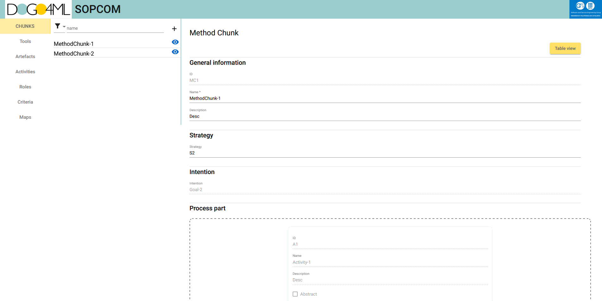

# SOPCOMFrontend

## Information
Frontend of the Final Project of Computer Science Degree 
 
In this project, the development of SOPCOM has continued, a tool that consists of a web
application and an API, which aims to provide the ability to manage software process
components. With the new version created, the aim is to considerably expand the
functionalities offered and adapt the present elements in the project. The application places
particular emphasis on the methodology used, focused on adapting to the situation the user
is currently in, which is called Situational Method Engineering. 
The system is a proposal made by the software and services engineering research group
(GESSI) of the UPC. This new version will give greater value to the system, improving the
tools of research groups interested in the use of the methodology.

 
 

## Development server

This project was generated with [Angular CLI](https://github.com/angular/angular-cli) version 13.3.5.
Run `ng serve` for a dev server. Navigate to `http://localhost:4200/`. The application will automatically reload if you change any of the source files.

## Code scaffolding

Run `ng generate component component-name` to generate a new component. You can also use `ng generate directive|pipe|service|class|guard|interface|enum|module`.

## Build

Run `ng build` to build the project. The build artifacts will be stored in the `dist/` directory.

## Running unit tests

Run `ng test` to execute the unit tests via [Karma](https://karma-runner.github.io).

## Running end-to-end tests

Run `ng e2e` to execute the end-to-end tests via a platform of your choice. To use this command, you need to first add a package that implements end-to-end testing capabilities.

## Further help

To get more help on the Angular CLI use `ng help` or go check out the [Angular CLI Overview and Command Reference](https://angular.io/cli) page.
